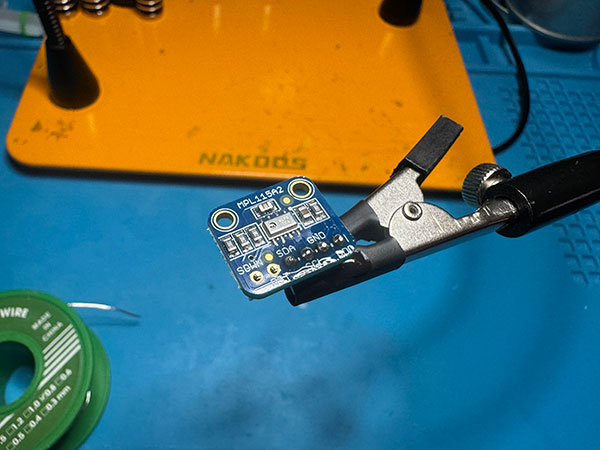

# Braiins Miner Thermostat

The purpose of this repo is to help you setup your own Braiins Thermostat for your Miner (S9, S17, S19 supported).

# Features
`Open Source`: Easy to build and assemble if you are a DIY person :)

`Thermostat`: Maintains temperature of your area by enabling or disabling the miner based on the deadband range you set for room temperature.

`Vented`: 3D model is vented so you don't need to run a fan on the unit

## Required Parts:

Approximate Cost: $90

- [ESP32 Micro Controller](https://amzn.to/46Gki7e)
- [Temperature Sensor](https://amzn.to/46x0Yt0)
- [90 Degree USBC Adapter](https://amzn.to/3sXdmEE)
- [Shrink Tubing](https://amzn.to/3ojl0H0)
- [Jumper Wires](https://amzn.to/3GPbUIl)
- [90 Degree Jumper Adapter](https://www.amazon.com/dp/B07C89T16T/ref=cm_sw_r_as_gl_api_gl_i_YCH53DA426VD8DCADNQT?linkCode=ml2&tag=wpwtg-20)
- [USBC Power Cable](https://amzn.to/3N3CCjo)
- [Power Adapter](https://amzn.to/49RG3DN)
- You will also need a 3D printer, soldering iron, and an Exacto Knife to clean up the 3D model.

## Assembly Instructions

### Print the 3D Model
Print the models and remove the supports.  The case and door STL's are located in the 3D folder in the repo.  

### Micro Controller Configuration
While that is printing, lets prepare the micro controller.
- Download the [Arduino IDE](https://www.arduino.cc/en/software)
- Once installed, connect the micro controller to your computer via USBC, and from the dropdown select "Select other board and port...", and select the "ESP32 Dev Module" and on the right select your USB port that it is connected to.
- Copy and paste the code from the arduino-code folder into the editor. Change the variable `thermostatTargetTemp` to your desired room temperature.  (In a future commit this will not be necessary).
- Click the upload button (the second button on the top left).  Once it uploads to the micro controller you should see the Bitcoin ATM screen.  It can safely be removed from the computer and is ready for the assembly into our box.

### Prepare the temperature sensor

 

Solder the pins with the small side up through the board.  I recommend using some flux as the soldering flows much smoother with a small dab of it.  It should look like this:  

### Prepare the jumper wires

Next, we are going to modify the male end of our jumper wires to have a 90 degree bend.  

Break apart our 90 degree adapters to individual pieces (qty 4), and solder them to the ends of our jumper wires.  

When soldering is done, cut some shrink tubing (1/8") to about an inch long and heat them around our conversion.  

### Fitting everything together

Now that everything is ready, we get to assemble everything together.  You will need your 3D model, USBC 90 degree adapter, and Micro Controller display.  

Slide the adapter in from the top until you can slide it through the hole in the back of the model.  
 

Next, take apart the LCD panel. There are tiny little tabs that lock into the metal plate so gently pry them until you can get the top and bottom separated.   
 
 

Next, bring the display through the unit at an angle, straighten it out, and line up the usbc port to snap it down into place.  
 
 
 

Everything should lock together when you press the display against itself.  I do recommend putting a small amount of hot glue in the top lef/right corners and on the UBBC port inside the model to hold everything even tighter ito place.   
 
 

Push the thermostat sensor into the top of the model as shown below  
 

Connect the wires to thermostat sensor and microcontroller as shown:  
 

The micro controller pins all go along the back row and are as follows (from the right):
- Red (1)
- Black (3)
- Yellow (8)
- Blue (9)

 

Slide the door on the back and our assembly is ready to run! 
 
 
 

### Final Product
Our final product is ready to use :)   

 

### Initial Configuration
When the thermostat boots, if it cannot connect to wifi it will enter configuration mode. This mode enables a hotspot that you can connect to on your phone called "BitThermo".  You will not need a password.  Once connected, navigate to http://192.168.4.1 in your browser and enter the configuration settings. When submitted, the device will auto reboot and be all setup!

# License
The code distributed and the product itself is GPLv3.  The purpose of this is to protect the community and ensure that any innovations will remain public under the following license agreements:

1. Anyone can copy, modify and distribute this software.
2. You have to include the license and copyright notice with each and every distribution.
3. You can use this software privately.
4. You can use this software for commercial purposes.
5. If you dare build your business solely from this code, you risk open-sourcing the whole code base.
6. If you modify it, you have to indicate changes made to the code.
7. Any modifications of this code base MUST be distributed with the same license, GPLv3.
8. This software is provided without warranty.
9. The software author or license can not be held liable for any damages inflicted by the software.

More information about this license can be found [here](http://choosealicense.com/licenses/gpl-3.0/).